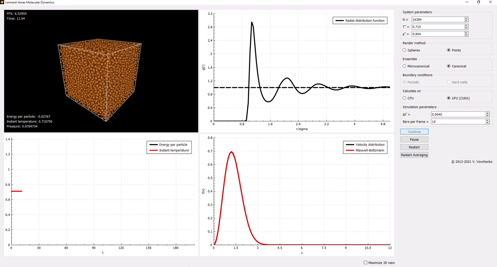
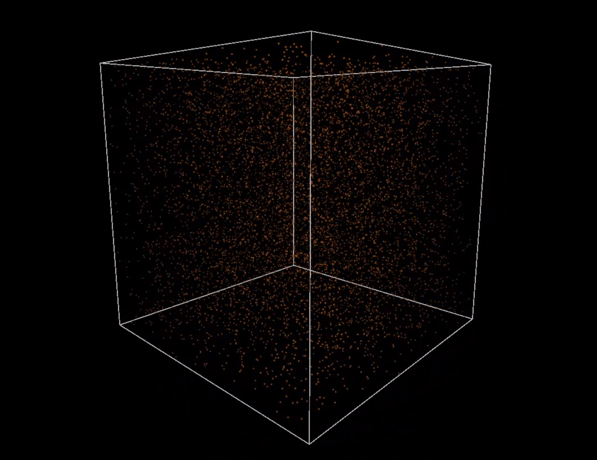
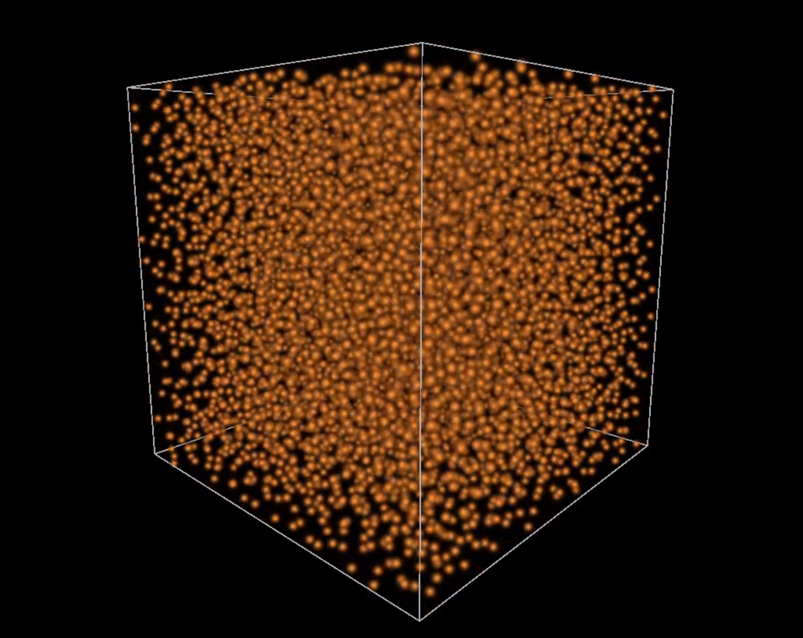
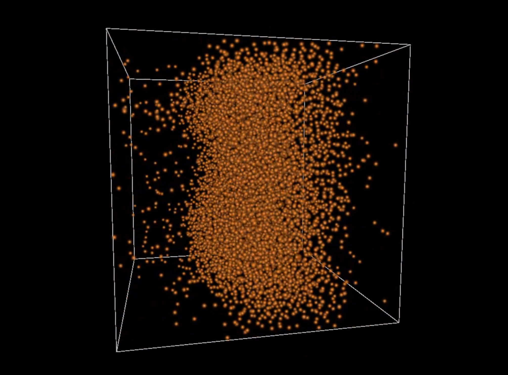
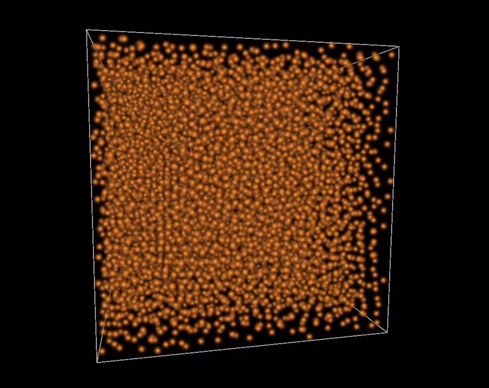

# Lennard-Jones Molecular Dynamics

An implementation of molecular dynamics simulation of the [**Lennard-Jones system**](https://en.wikipedia.org/wiki/Lennard-Jones_potential) in a box with real-time visualization. 
The code solves the N-body problem numerically and utilizes CUDA-enabled NVIDIA GPU's to significantly accelerate the calculations, allowing real-time simulation (~60 frames per second) of large systems containing thousands of particles.
The code uses reduced variables and allows to study the thermodynamic properties of the Lennard-Jones system.

This implementation was inspired by the [nbody](https://developer.nvidia.com/gpugems/gpugems3/part-v-physics-simulation/chapter-31-fast-n-body-simulation-cuda) example from NVIDIA CUDA SDK.

The code is separated into three parts:
- the core library
- a graphical user interface (GUI) program to run the box simulation and visualization
- an [example](src/tasks/semiGCEfluctuations/semiGCEfluctuations.cpp) of running the simulation from command line


## Features

- Adjust the number of particles, temperature and density, and the time step
- Switch between CPU or GPU (CUDA) based calculation
- Velocity Verlet integrator
- Microcanonical (*EVN*) or canonical (*TVN*, Andersen-like thermostat) ensemble
- Periodic or hard-wall boundary conditions
- Real-time visualization of the system motion (in OpenGL)
- Calculation and visualization of the [radial distribution function](https://en.wikipedia.org/wiki/Radial_distribution_function) and the velocity distribution

<p align="center">
  
</p>

## Prerequisites

- [CMake](https://cmake.org/) v3.10+
- [NVIDIA CUDA Toolkit](https://developer.nvidia.com/cuda-toolkit), tested on v10.2+
- [Qt5](https://doc.qt.io/qt-5/) framework and **OpenGL** support to run the GUI
- CUDA-enabled GPU (otherwise only the CPU simulation can be used) with compute capability 3.0+
  
The code is cross-platform and based on CMake. It has been tested on Microsoft Windows 10 (using Visual Studio or CLion IDE) and Ubuntu 20.04 (via the command line)

## Usage

Use the CMake to generate the project and build it.
Make sure that CMake can find the CUDA toolkit and Qt5.
An example on Unix:

```bash
mkdir build
cd build
cmake ../
make

# Run the GUI program
./src/gui/QtLennardJones
```


## Examples

|   |   |
|:-------------------------:|:-------------------------:|
| gaseous phase (T* = 1, ρ* = 0.01) | liquid phase (T* = 1, ρ* = 0.85)|
|   |   |
| mixed phase (T* = 1, ρ* = 0.3) | solid phase (T* = 1, ρ* = 1.1)|

## Third-party code

- The [`helper-cuda.h`](https://raw.githubusercontent.com/NVIDIA/cuda-samples/master/Common/helper_cuda.h) and [`helper_string.h`](https://raw.githubusercontent.com/NVIDIA/cuda-samples/master/Common/helper_string.h) CUDA headers that are either downloaded from GitHub at the CMake step or taken from CUDA SDK if it is installed in the system
- [**Mersenne Twister**](http://www.math.sci.hiroshima-u.ac.jp/~m-mat/MT/emt.html) random number generator by M. Matsutomo and T. Nishimura ([implementation](http://www.math.sci.hiroshima-u.ac.jp/~m-mat/MT/VERSIONS/C-LANG/MersenneTwister.h) by R. J. Wagner)
- [**Qt5 framework**](https://www.qt.io) for the GUI frontend ([LGPL3](http://doc.qt.io/qt-5/lgpl.html))
- [**QCustomPlot**](https://www.qcustomplot.com/) Qt C++ widget for plotting and data visualization by Emanuel Eichhammer ([GPL](https://www.gnu.org/licenses/gpl.html))


*Copyright (C) 2013-2021  Volodymyr Vovchenko*
